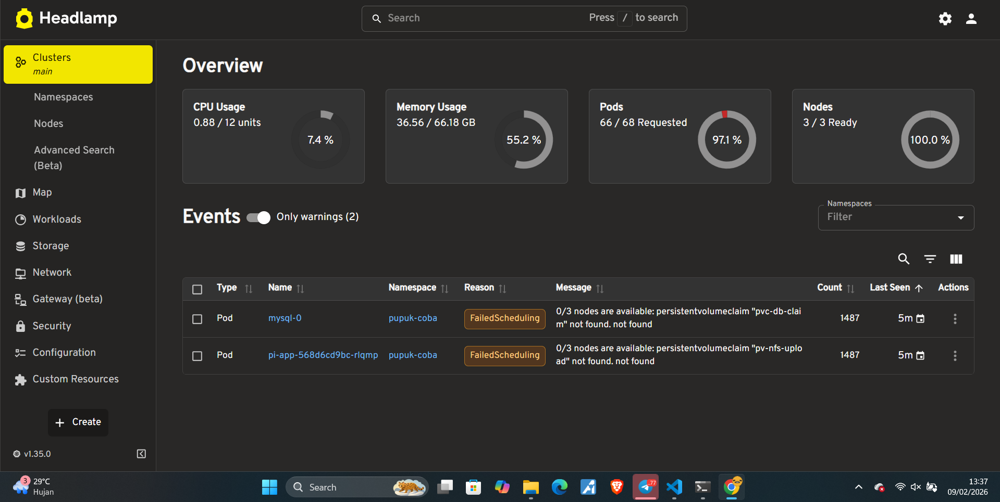
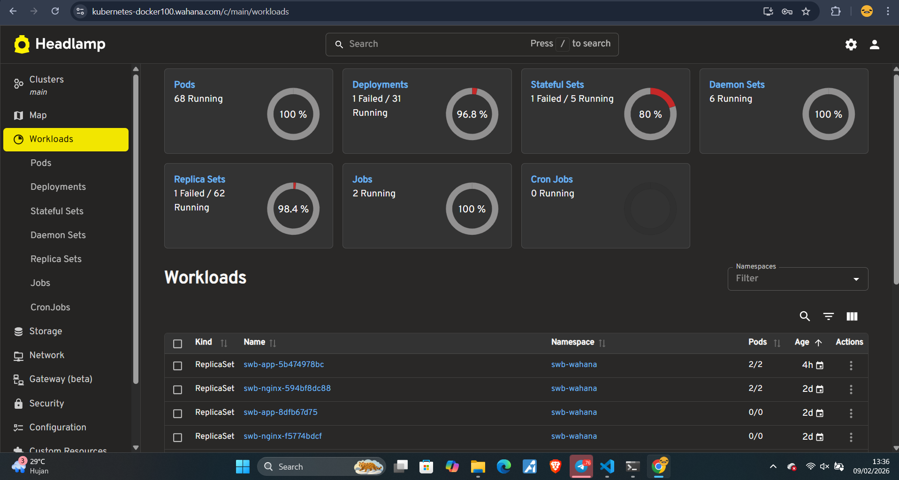
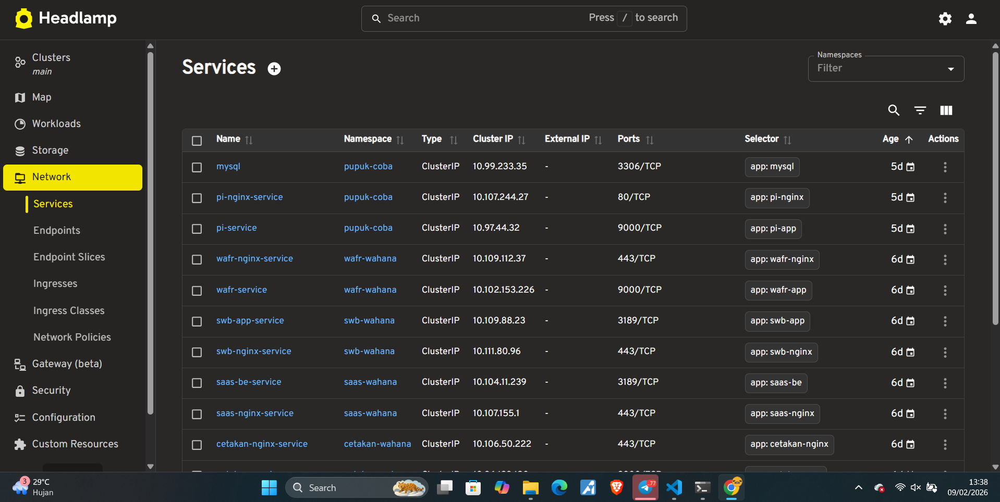
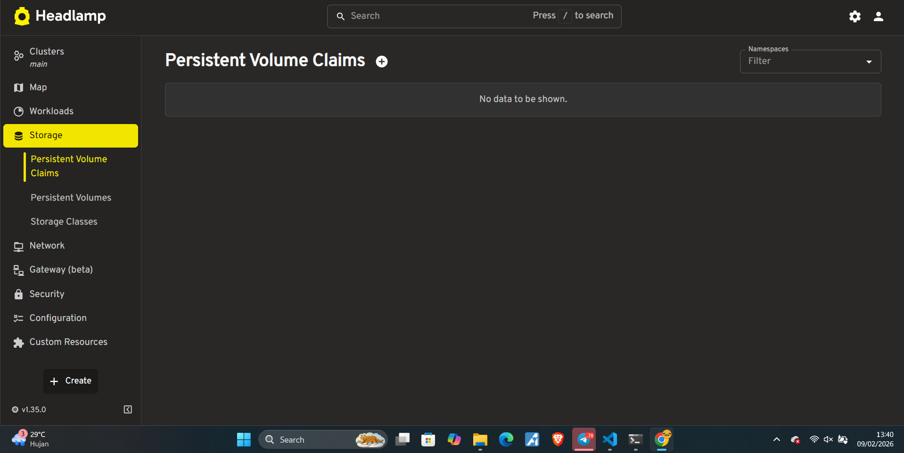
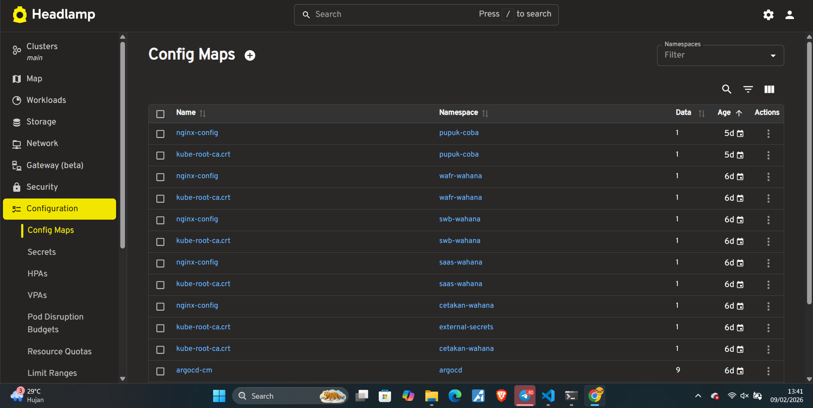
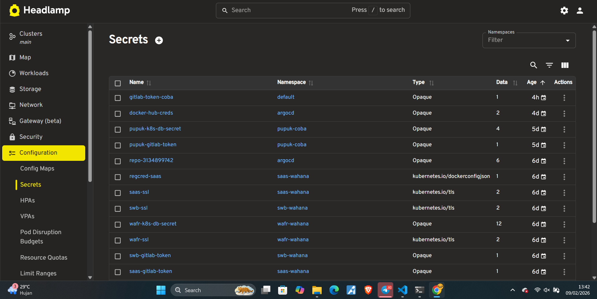
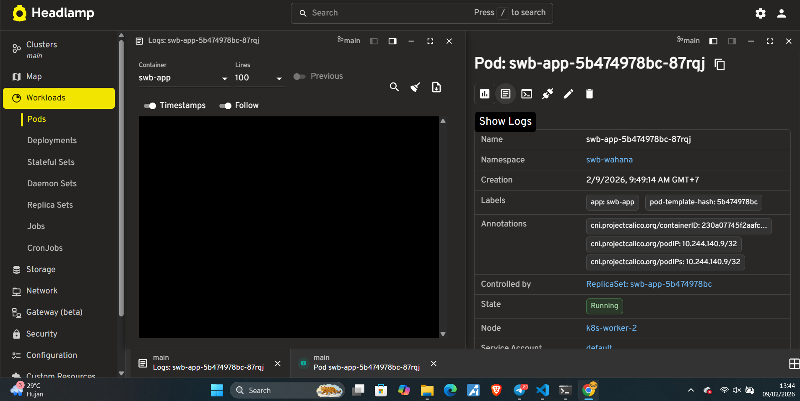
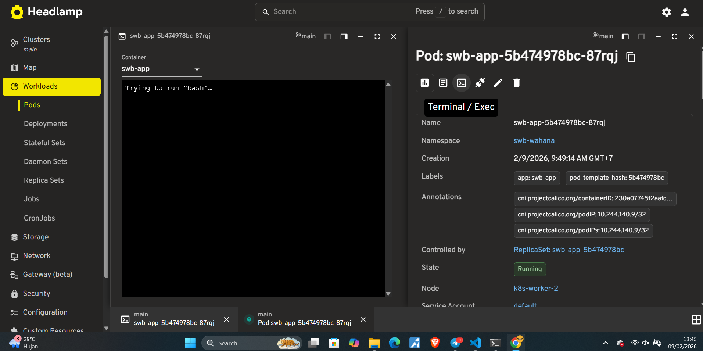
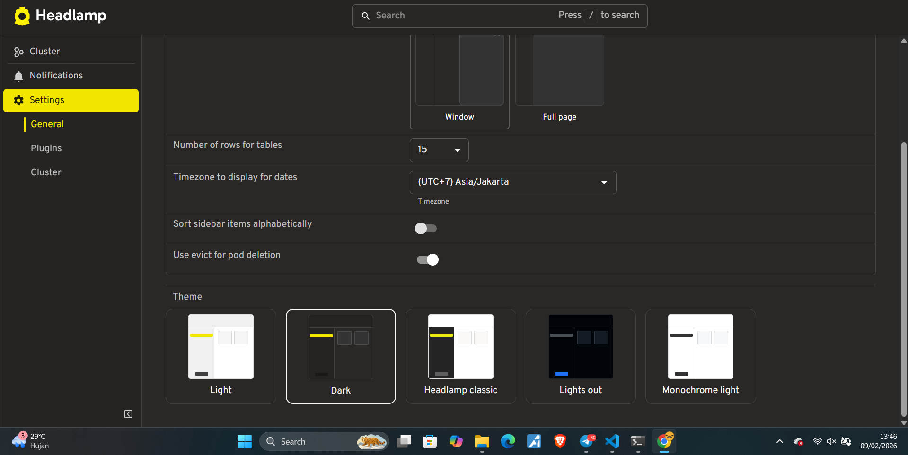

# Cara Install Headlamp - Monitoring Tool untuk Kubernetes

## Apa yang Akan Anda Dapatkan?

Setelah mengikuti panduan ini:

✅ Headlamp terinstall di cluster Kubernetes  
✅ Dashboard web untuk monitoring  
✅ Bisa lihat semua pods, services, deployments, dll  
✅ Real-time monitoring CPU & Memory  
✅ Akses via domain (misal: `kubernetes-docker100.wahana.com`)  
✅ Tidak perlu token untuk login (auto-authentication)  

---

## Berapa Lama Prosesnya?

- **Waktu:** 15-20 menit
- **Tingkat Kesulitan:** Mudah
- **Yang Dibutuhkan:**
  - Cluster Kubernetes yang sudah jalan. Jika belum ada, bisa melihat proses instalasi cluster di [ dokumentasi ini ](1.%20Instalasi-kubernetes-3-node-cluster.md )
  - MetalLB & NGINX Ingress sudah terinstall. Jika belum, lihat di [ dokumentasi ini ]( 2.%20instalasi-ingress-metallb.md )
  - Helm sudah terinstall

---

## Langkah-Langkah Instalasi

### LANGKAH 1: Masuk ke Server Master

1. Buka **Terminal**
2. Login SSH ke server master:

```bash
ssh username@192.168.2.104
```

✅ **Sudah masuk? Lanjut!**

---

### LANGKAH 2: Pastikan Helm Sudah Terinstall

Headlamp diinstall menggunakan Helm (package manager untuk Kubernetes).

#### Langkah 2.1: Cek Apakah Helm Sudah Ada

```bash
helm version
```

**Output yang diharapkan:**
```
version.BuildInfo{Version:"v3.14.0", ...}
```

✅ **Kalau muncul versi Helm, berarti sudah terinstall!**

#### Langkah 2.2: Kalau Helm Belum Ada (Install Dulu)

```bash
curl https://raw.githubusercontent.com/helm/helm/main/scripts/get-helm-3 | bash
```

**Tunggu 10-30 detik**, lalu verifikasi:

```bash
helm version
```

✅ **Helm siap digunakan!**

---

### LANGKAH 3: Install Headlamp dengan Helm

#### Langkah 3.1: Tambahkan Headlamp Repository

Helm perlu tahu dari mana download Headlamp.

```bash
helm repo add headlamp https://kubernetes-sigs.github.io/headlamp/
```

**Output:**
```
"headlamp" has been added to your repositories
```

#### Langkah 3.2: Update Repository

```bash
helm repo update
```

**Output:**
```
Hang tight while we grab the latest from your chart repositories...
...Successfully got an update from the "headlamp" chart repository
Update Complete. ⎈Happy Helming!⎈
```

#### Langkah 3.3: Install Headlamp

Sekarang install Headlamp di namespace khusus bernama `headlamp`.

```bash
helm install my-headlamp headlamp/headlamp --namespace headlamp --create-namespace
```

**Penjelasan:**
- `my-headlamp` → Nama release (bisa diganti apa saja)
- `headlamp/headlamp` → Chart yang akan diinstall
- `--namespace headlamp` → Install di namespace `headlamp`
- `--create-namespace` → Buat namespace otomatis kalau belum ada

**Output:**
```
NAME: my-headlamp
LAST DEPLOYED: Mon Feb 09 10:00:00 2026
NAMESPACE: headlamp
STATUS: deployed
REVISION: 1
TEST SUITE: None
NOTES:
...
```

**Tunggu 1-2 menit** untuk proses instalasi.

---

### LANGKAH 4: Verifikasi Instalasi

#### Langkah 4.1: Cek Pods Headlamp

```bash
kubectl get pods -n headlamp
```

**Output yang diharapkan:**
```
NAME                        READY   STATUS    RESTARTS   AGE
headlamp-xxxxxxxxxx-xxxxx   1/1     Running   0          2m
```

**Yang penting:** Status harus `Running` dan `READY` harus `1/1`.

⚠️ **Kalau masih `ContainerCreating`:**
- Tunggu 1-2 menit lagi
- Ketik perintah yang sama lagi
- Kalau lebih dari 5 menit masih belum `Running`, cek log: `kubectl logs headlamp-xxxxx -n headlamp`

#### Langkah 4.2: Cek Service Headlamp

```bash
kubectl get svc -n headlamp
```

**Output:**
```
NAME       TYPE        CLUSTER-IP      EXTERNAL-IP   PORT(S)   AGE
headlamp   ClusterIP   10.96.123.45    <none>        80/TCP    2m
```

**Catatan:** Service type adalah `ClusterIP` (default) - hanya bisa diakses dari dalam cluster.

✅ **Headlamp sudah terinstall!**

---

### LANGKAH 5A: Akses Headlamp via Port Forward (Testing)

**Cara ini untuk testing cepat tanpa perlu setup Ingress.**

#### Langkah 5A.1: Buat Port Forward

Di terminal server master, jalankan:

```bash
kubectl port-forward -n headlamp svc/headlamp 8080:80
```

**Penjelasan:**
- `svc/headlamp` → Service yang akan di-forward
- `8080:80` → Port lokal 8080 → Port service 80

**Output:**
```
Forwarding from 127.0.0.1:8080 -> 4466
Forwarding from [::1]:8080 -> 4466
```

⚠️ **PENTING:**
- **JANGAN TUTUP terminal ini!** Biarkan tetap terbuka.
- Port forward akan terputus kalau terminal ditutup.

#### Langkah 5A.2: Akses dari Browser (Jika di Server Master Langsung)

Kalau Anda buka browser **di server master langsung** (bukan remote):

```
http://localhost:8080
```

#### Langkah 5A.3: Akses dari Laptop/Komputer Lain

**Kalau Anda SSH dari laptop/komputer lain**, Anda perlu **SSH tunnel**.

**Di laptop/komputer Anda (bukan di server), buka terminal baru:**

```bash
ssh -L 8080:localhost:8080 username@192.168.2.104
```

**Penjelasan:**
- `-L 8080:localhost:8080` → Tunnel port 8080 laptop ke port 8080 server
- `username@192.168.2.104` → Server master

**Lalu buka browser di laptop:**

```
http://localhost:8080
```

#### Langkah 5A.4: Login Headlamp

**Kalau muncul halaman login:**

Headlamp akan otomatis detect kubeconfig di server. Biasanya **TIDAK PERLU token** kalau akses dari server master.

**Kalau diminta token:**

```bash
kubectl -n headlamp create token headlamp
```

Copy token yang muncul, paste ke halaman login.

🎉 **Kalau berhasil, Anda akan masuk ke dashboard Headlamp!**

---

### LANGKAH 5B: Akses Headlamp via Ingress (Production)

**Cara ini untuk akses permanen via domain, tanpa port-forward.**

#### Langkah 5B.1: Buat File Ingress

Buat folder untuk manifest:

```bash
mkdir -p ~/headlamp-ingress
cd ~/headlamp-ingress
```

Buat file ingress:

```bash
nano headlamp-ingress.yaml
```

Isi dengan:

```yaml
apiVersion: networking.k8s.io/v1
kind: Ingress
metadata:
  name: headlamp-ingress
  namespace: headlamp
  annotations:
    kubernetes.io/ingress.class: "nginx"
    nginx.ingress.kubernetes.io/use-gzip: "true"
spec:
  ingressClassName: nginx
  rules:
  - host: kubernetes-docker100.wahana.com
    http:
      paths:
      - path: /
        pathType: Prefix
        backend:
          service:
            name: headlamp
            port:
              number: 80
```

**⚠️ Ubah:**
- `host` → Domain yang Anda inginkan (contoh: `kubernetes-docker100.wahana.com`)

**Penjelasan:**
- **kubernetes.io/ingress.class: "nginx"** → Pakai NGINX Ingress Controller
- **nginx.ingress.kubernetes.io/use-gzip: "true"** → Compress response untuk hemat bandwidth
- **ingressClassName: nginx** → Wajib untuk NGINX Ingress
- **service name: headlamp** → Service yang akan menerima traffic

**Simpan:** `Ctrl+X`, `Y`, `Enter`

#### Langkah 5B.2: Apply Ingress

```bash
kubectl apply -f headlamp-ingress.yaml
```

**Output:**
```
ingress.networking.k8s.io/headlamp-ingress created
```

#### Langkah 5B.3: Verifikasi Ingress

```bash
kubectl get ingress -n headlamp
```

**Output yang diharapkan:**
```
NAME               CLASS   HOSTS                              ADDRESS         PORTS   AGE
headlamp-ingress   nginx   kubernetes-docker100.wahana.com    192.168.2.240   80      30s
```

**Lihat kolom `ADDRESS`:**
- Harus terisi dengan **IP LoadBalancer** dari MetalLB
- Kalau masih kosong, tunggu 1-2 menit lagi

✅ **Ingress sudah terdaftar!**

---

### LANGKAH 6: Setup /etc/hosts

Agar bisa akses Headlamp via domain, tambahkan IP LoadBalancer dan nama host di /etc/hosts.

#### Langkah 6.1: Cari IP LoadBalancer

```bash
kubectl get ingress -n headlamp
```

Catat IP di kolom `ADDRESS`, misal: `192.168.2.240`

#### Langkah 6.2: Tambahkan ke /etc/hosts

**Di Server Master:**

```bash
sudo nano /etc/hosts
```

Tambahkan baris:

```
192.168.2.240  kubernetes-docker100.wahana.com
```

**⚠️ Ganti IP dan domain sesuai setup Anda!**

**Simpan:** `Ctrl+X`, `Y`, `Enter`

**Di Laptop/Komputer Windows:**

1. Buka Notepad **sebagai Administrator**
2. File → Open → `C:\Windows\System32\drivers\etc\hosts`
3. Ubah file type ke "All Files"
4. Tambahkan:
   ```
   192.168.2.240  kubernetes-docker100.wahana.com
   ```
5. Save

**Di Laptop/Komputer Linux/Mac:**

```bash
sudo nano /etc/hosts
```

Tambahkan:
```
192.168.2.240  kubernetes-docker100.wahana.com
```

---

### LANGKAH 7: Akses Headlamp di Browser!

#### Langkah 7.1: Buka Browser

Buka browser (Chrome/Firefox/Edge), ketik:

```
http://kubernetes-docker100.wahana.com
```

**⚠️ Ganti dengan domain Anda!**

#### Langkah 7.2: Halaman Headlamp Muncul!

Kalau berhasil, Anda akan melihat **dashboard Headlamp!**

Tampilan awal:
- **Sidebar kiri:** Menu untuk Workloads, Network, Storage, Config, dll
- **Tengah:** Overview cluster (jumlah nodes, pods, deployments, dll)
- **Kanan atas:** Dark mode toggle, settings

🎉 **SELAMAT! Headlamp sudah bisa diakses!**

---

## Fitur-Fitur Headlamp

### 1. Cluster Overview (Halaman Utama)

Di halaman utama, Anda bisa lihat:



- **Jumlah Nodes:** Berapa nodes yang ada di cluster
- **Jumlah Pods:** Total pods yang jalan
- **CPU & Memory Usage:** Grafik real-time penggunaan resource
- **Recent Events:** Event terbaru di cluster (pod created, scaled, dll)

### 2. Workloads

Klik **"Workloads"** di sidebar, Anda bisa lihat:



**Pods:**
- Semua pods yang jalan di semua namespace
- Status (Running, Pending, Error)
- CPU & Memory usage per pod
- Klik pod untuk lihat detail, logs, terminal

**Deployments:**
- Semua deployments
- Jumlah replicas (desired vs current)
- Image yang dipakai
- Bisa edit deployment langsung dari UI

**StatefulSets, DaemonSets, Jobs, CronJobs:**
- Semua jenis workload lainnya

### 3. Network

Klik **"Network"** di sidebar:



**Services:**
- Semua services
- Type (ClusterIP, NodePort, LoadBalancer)
- Port mapping

**Ingress:**
- Semua Ingress rules
- Domain → Service mapping

### 4. Storage



**PersistentVolumes & PersistentVolumeClaims:**
- Storage yang dipakai aplikasi
- Capacity, status

### 5. Config & Secrets



**ConfigMaps:**
- Lihat semua ConfigMaps
- Bisa edit langsung dari UI



**Secrets:**
- Lihat semua Secrets (tapi value tidak ditampilkan, untuk keamanan)

### 6. Logs & Terminal



**Lihat Logs Pods:**
1. Klik **"Workloads"** → **"Pods"**
2. Klik salah satu pod
3. Klik tab **"Logs"**
4. Logs akan muncul real-time!



**Exec ke Pods (Terminal):**
1. Klik pod
2. Klik tab **"Terminal"**
3. Pilih container (kalau ada multiple containers)
4. Terminal akan muncul - Anda bisa jalankan command di dalam pod!

### 7. Dark Mode



**Aktifkan Dark Mode:**
1. Klik icon **"Settings"** (gerigi) di kanan atas
2. Toggle **"Dark Mode"**
3. Enjoy!

---

## Troubleshooting - Kalau Ada Masalah

### Masalah 1: Pods Headlamp Stuck di "Pending"

**Gejala:**

```bash
kubectl get pods -n headlamp
```

Output:
```
NAME                        READY   STATUS    RESTARTS   AGE
headlamp-xxxxx              0/1     Pending   0          5m
```

**Penyebab:**
- Worker node kehabisan resource (CPU/RAM)
- Tidak ada node yang bisa schedule pods

**Solusi:**

1. **Cek detail pods:**
```bash
kubectl describe pod headlamp-xxxxx -n headlamp
```

Lihat bagian `Events` - biasanya ada pesan seperti:
```
0/3 nodes are available: 3 Insufficient memory.
```

2. **Cek resource nodes:**
```bash
kubectl top nodes
```

Kalau CPU/Memory >90%, Anda perlu:
- Upgrade resource server
- Atau hapus pods lain yang tidak penting

3. **Kalau karena taint di master node:**

Master node biasanya punya `taint` yang mencegah pods normal jalan di sana.

```bash
kubectl describe node k8s-master | grep Taints
```

Kalau ada `NoSchedule`, Anda bisa:
- **Opsi A:** Biarkan saja, tunggu worker node available
- **Opsi B:** Hapus taint (NOT RECOMMENDED untuk production):
  ```bash
  kubectl taint nodes k8s-master node-role.kubernetes.io/control-plane:NoSchedule-
  ```

---

### Masalah 2: Port Forward Terputus Terus

**Gejala:**

Setelah beberapa menit, port forward putus otomatis.

**Penyebab:**
- Koneksi SSH terputus
- Idle timeout

**Solusi:**

**Pakai Ingress (Recommended)**

Lebih baik pakai Ingress (LANGKAH 5B) daripada port-forward untuk akses permanen.

---

### Masalah 3: Headlamp Loading Terus (Infinite Loading)

**Gejala:**

Halaman Headlamp muncul, tapi ada loading animation terus-terusan.

**Penyebab:**
- Headlamp tidak bisa connect ke Kubernetes API
- RBAC permission issue

**Solusi:**

1. **Cek log Headlamp:**
```bash
kubectl logs -n headlamp deployment/headlamp
```

Lihat apakah ada error message.

2. **Restart Headlamp:**
```bash
kubectl rollout restart deployment headlamp -n headlamp
```

3. **Cek ServiceAccount & RBAC:**

Headlamp butuh permission untuk baca cluster.

```bash
kubectl get serviceaccount -n headlamp
kubectl get clusterrolebinding | grep headlamp
```

Harusnya ada ServiceAccount bernama `headlamp` dan ClusterRoleBinding.

---

### Masalah 4: Error "Forbidden" atau "Unauthorized"

**Gejala:**

Di Headlamp, muncul pesan error "Forbidden" atau "Unauthorized" saat akses resource tertentu.

**Penyebab:**
- RBAC permission tidak cukup
- ServiceAccount tidak punya akses

**Solusi:**

**Buat ClusterRoleBinding untuk full access:**

```bash
kubectl create clusterrolebinding headlamp-admin \
  --clusterrole=cluster-admin \
  --serviceaccount=headlamp:headlamp
```

**⚠️ Perhatian:** Ini memberikan akses penuh ke cluster. Untuk production, sebaiknya gunakan role yang lebih terbatas.

---

### Masalah 5: Metrics (CPU/Memory) Tidak Muncul

**Gejala:**

Di Headlamp, grafik CPU dan Memory kosong atau tidak ada.

**Penyebab:**
- Metrics Server belum terinstall

**Solusi:**

Install Metrics Server:

```bash
kubectl apply -f https://github.com/kubernetes-sigs/metrics-server/releases/latest/download/components.yaml
```

Patch untuk bare metal cluster:

```bash
kubectl patch deployment metrics-server -n kube-system --type='json' \
  -p='[{"op": "add", "path": "/spec/template/spec/containers/0/args/-", "value": "--kubelet-insecure-tls"}]'
```

Tunggu 2-3 menit, refresh halaman Headlamp, metrics harusnya sudah muncul.

---

## Perintah Penting untuk Dicatat

```bash
# Cek pods Headlamp
kubectl get pods -n headlamp

# Cek service Headlamp
kubectl get svc -n headlamp

# Cek Ingress Headlamp
kubectl get ingress -n headlamp

# Cek log Headlamp
kubectl logs -n headlamp deployment/headlamp

# Restart Headlamp
kubectl rollout restart deployment headlamp -n headlamp

# Port forward (untuk testing)
kubectl port-forward -n headlamp svc/headlamp 8080:80

# Uninstall Headlamp
helm uninstall my-headlamp -n headlamp

# Update Headlamp ke versi terbaru
helm repo update
helm upgrade my-headlamp headlamp/headlamp -n headlamp

# Lihat versi Headlamp yang terinstall
helm list -n headlamp
```

---

## Update Headlamp ke Versi Baru

Kalau ada versi baru Headlamp:

### 1. Update Repository

```bash
helm repo update
```

### 2. Cek Versi Terbaru

```bash
helm search repo headlamp
```

**Output:**
```
NAME              CHART VERSION   APP VERSION   DESCRIPTION
headlamp/headlamp 0.20.0          v0.20.0       Headlamp - A web UI for Kubernetes
```

### 3. Upgrade Headlamp

```bash
helm upgrade my-headlamp headlamp/headlamp -n headlamp
```

**Output:**
```
Release "my-headlamp" has been upgraded. Happy Helming!
```

### 4. Verifikasi

```bash
kubectl get pods -n headlamp
```

Pods akan restart dengan image baru.

✅ **Headlamp sudah update!**

---

## Uninstall Headlamp (Kalau Tidak Dipakai Lagi)

### Hapus via Helm

```bash
helm uninstall my-headlamp -n headlamp
```

**Output:**
```
release "my-headlamp" uninstalled
```

### Hapus Namespace (Opsional)

```bash
kubectl delete namespace headlamp
```

### Hapus Ingress (Kalau Sudah Buat)

```bash
kubectl delete ingress headlamp-ingress -n headlamp
```

✅ **Headlamp sudah terhapus dari cluster!**

---

## Tips & Trik Headlamp

### 1. Bookmark URL Headlamp

Supaya tidak lupa:
```
http://kubernetes-docker100.wahana.com
```

### 2. Gunakan Search

Di Headlamp, ada **search box** di atas. Anda bisa cari pods/services berdasarkan nama dengan cepat!

### 3. Filter by Namespace

Kalau punya banyak namespace, gunakan **namespace filter** di kanan atas untuk hanya lihat namespace tertentu.

### 4. Export Logs

Kalau perlu save logs pods:
1. Buka logs pods
2. Klik icon **"Download"** di kanan atas logs viewer
3. Logs akan tersimpan sebagai file `.txt`

### 5. Monitor Resource Usage

Headlamp punya **Resource Usage** chart yang update real-time. Bagus untuk monitoring cluster health.

---

## Kesimpulan

**Apa yang sudah Anda capai:**

✅ Headlamp terinstall di cluster Kubernetes  
✅ Dashboard web monitoring dan modern  
✅ Bisa akses via domain tanpa port-forward  
✅ Real-time monitoring semua resource  
✅ Bisa lihat logs dan exec ke pods dari browser  

**Headlamp sekarang bisa diakses di:**
```
http://kubernetes-docker100.wahana.com
```

**Atau via port-forward:**
```
http://localhost:8080
```


## Referensi


[Headlamp Documentation - Installation](https://headlamp.dev/docs/latest/installation/#installing-headlamp)

[Artifact Hub - Headlamp](https://artifacthub.io/packages/helm/headlamp/headlamp)

[Kubernetes Docs - Use Port Forwarding to Access Applications](https://kubernetes.io/docs/tasks/access-application-cluster/port-forward-access-application-cluster/#forward-a-local-port-to-a-port-on-the-pod)

[Kubernetes Docs - Ingress Resource](https://kubernetes.io/docs/concepts/services-networking/ingress/)

[Headlamp Docs - Authentication](https://headlamp.dev/docs/latest/installation/in-cluster/basic-auth)

[Metrics Server - Command Line Arguments (Lihat bagian arguments).](https://github.com/kubernetes-sigs/metrics-server?tab=readme-ov-file#configuration)


[Helm Docs - Installing Helm](https://helm.sh/docs/helm/helm_upgrade/)